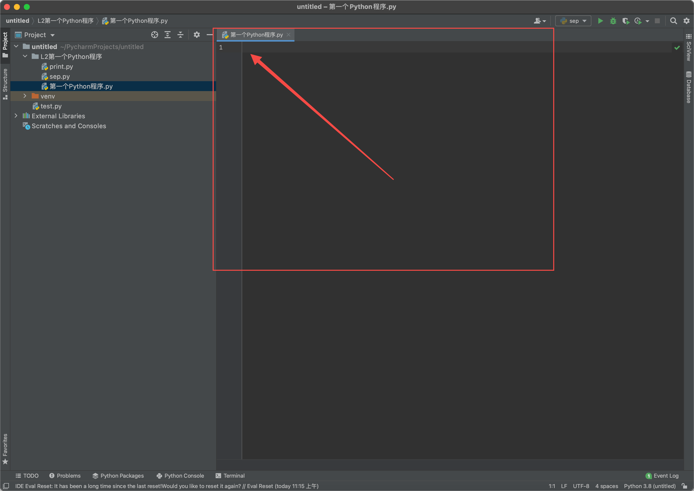

# 上手手册

## 第一个Python程序

> 用Python打招呼，说出“Hello，大家好，我是Python，很高兴遇见你们^_^”

### 第一步

#### 新建程序文件（Python 文件.py）

如图所示：

##### 1、在左侧“Project”界面中，将“鼠标光标移动”至“文件夹”处

##### 2、单机鼠标右键➡️移动至“New”➡️再用鼠标左键点击下一栏中的“Python File”见如下图所示：

##### 3、在“光标闪动”的“Name”处，输入要新建程序文件的文件名称，如：第一个Python程序。输入完成后，按下键盘上的回车键，或双击下方的“Python file”。

##### 4、程序文件就新建好了，如下图所示：

我们可以在Project界面下找到我们新建的名为“第一个Python程序.py”的文件

##### 5、在打开的文件下，进行代码的编写

6、在上图所示位置中，输入代码

> print("Hello，大家好，我是Python，很高兴遇见你们^_^")

如下图示：

##### 6、在“空白区”点击右键，再在弹出的界面中，点击“Run'第一个Python程序'”

##### 7、在左下方看到程序运行结果

